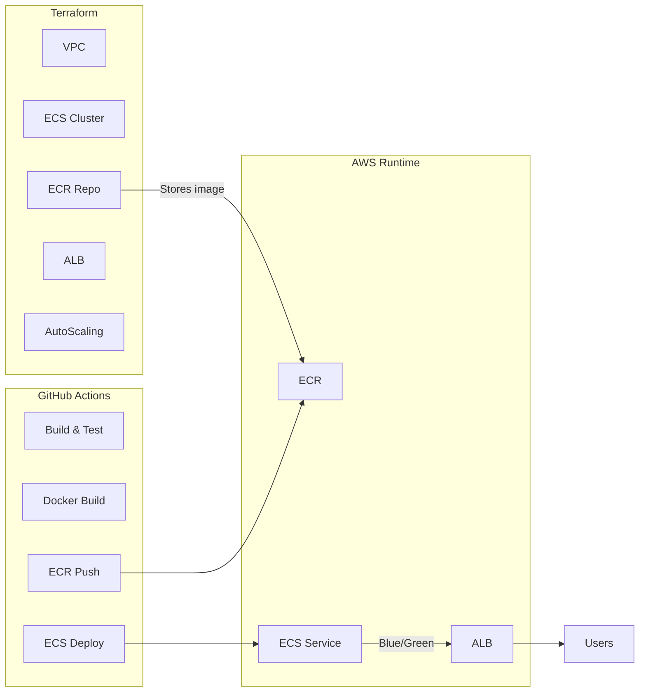

정확히 맞아.
다만 **조금 더 현대적인 구조로 아주 깔끔하게 정리**해줄 테니까
너가 발표할 때 **“전체 DevOps 파이프라인 개념을 완벽하게 설명할 수 있도록”** 만들어줄게.

너가 말한 흐름을 기술적으로 완전한 형태로 설명하면:

---

# 🎯 **발표용으로 완벽한 문장: 전체 파이프라인 개념**

> Terraform으로 AWS 인프라(ECS, ALB, ECR, VPC 등)를 구축해두고,
> 개발자가 GitHub에 코드를 push하면 GitHub Actions가 CI/CD 파이프라인을 실행하여
> Docker 이미지를 빌드 → ECR에 push하고,
> 이후 ECS 서비스가 Blue/Green 또는 Rolling 방식으로 자동 배포되어
> 최신 코드가 무중단 방식으로 업데이트된다.

너가 질문한 흐름은 100% 맞는 개념이야.

그런데 발표에서는 **조금 더 명확하게 “누가 어떤 역할을 하는지"**를 설명하면 훨씬 설득력이 높아진다.

---

# 🧩 전체 아키텍처 요약 (발표용)

## 🔵 [1단계] Terraform → AWS 인프라 프로비저닝(IaC)

Terraform은 다음 리소스들을 자동으로 생성:

* VPC, Subnet, IGW, NAT
* ECS Cluster
* ECS Service(Fargate)
* ECR Repository
* ALB + Target Group + Listener
* AutoScaling
* IAM Roles
* (선택) CodeDeploy(Blue/Green)

**여기까지가 실제 “인프라 고정 세팅 단계"**
즉, 이 단계는 자주 실행하는 게 아니라
초기 구축 + 환경 변경 시에 실행.

---

## 🟡 [2단계] GitHub Actions → CI/CD 자동화

개발자가 `push`하면 GitHub Actions가 다음을 수행:

### ✔ CI 단계

1. 소스 코드 체크아웃
2. Build

   * 백엔드: `mvn package`, `gradle build`
   * 프론트: `npm build`, `yarn build`
3. 테스트
4. Docker build
5. Docker image tag
6. Docker push → ECR

### ✔ CD 단계

1. 새 ECS Task Definition 생성
2. ECS Service update
3. Blue/Green or Rolling 방식 배포 트리거

➡ 배포가 성공하면 ALB는 새로운 컨테이너만 트래픽 받도록 전환된다.
➡ 완전한 무중단 배포.

---

## 🟢 [3단계] AWS ECS → Blue/Green 배포 실행

ECS는 자체적으로 두 가지 배포 옵션 제공:

* Rolling update
* **Blue/Green (CodeDeploy 방식)**

### Blue/Green 배포 방식의 흐름

1. ECS가 새로운 Task(컨테이너)를 Green 환경에서 먼저 실행
2. ALB Target Group에 등록
3. **Health Check 통과 확인**
4. 트래픽 비중을 Blue → Green으로 점진적 이동
5. Green이 완전히 안정화되면 Blue 종료

➡ 이 과정은 모두 자동이며, GitHub Actions는 단지 "배포 요청"만 보낸다.

---

# 🟣 즉, 정리하면 흐름은 이렇게 된다

---

# 🔥 발표 시 **핵심 메시지**는 이것 하나면 된다:

> **Terraform은 "환경(infrastructure)을 준비하는 도구"이고,
> GitHub Actions는 "애플리케이션을 배포하는 도구"이다.**
>
> Terraform은 인프라만 담당하고,
> GitHub Actions는 빌드 → 테스트 → 도커 → ECR → ECS 배포라는 CI/CD만 담당한다.

이 두 개가 연결되면
현대적 Cloud Native 배포 파이프라인이 완성된다.

---

# 🎤 발언 예시 (발표용 멘트 형태)

> “먼저 Terraform을 통해 AWS의 전체 인프라를 코드로 정의하고 자동으로 생성합니다.
> 인프라 구성은 한 번 만들어놓으면 계속 재사용 가능합니다.
>
> 이후 개발자는 단순히 Git에 코드를 push하면 됩니다.
>
> GitHub Actions가 실행되어 애플리케이션을 Docker 이미지로 빌드하고
> AWS ECR에 업로드합니다.
>
> 업로드가 끝나면 GitHub Actions는 ECS에 배포 명령을 보내고,
> ECS는 Blue/Green 방식으로 새로운 Task를 띄워
> 헬스 체크 후 ALB가 트래픽을 새 버전으로 전환합니다.
>
> 이 과정은 완전 자동화되어 있어 운영자가 직접 서버에 접속할 필요가 없습니다.”

---

# 📌 마지막으로, 너가 말한 흐름을 “정확한 YES/NO”로 대답하면?

### ✔ Terraform → AWS 셋업

### ✔ git push → GitHub Actions CI

### ✔ Docker build → ECR push

### ✔ GitHub Actions가 ECS 배포 요청

### ✔ AWS에서 Blue/Green 자동으로 수행

정답:

### **100% 맞다. 완벽한 현대적 배포 파이프라인이다.**

---

원하면 다음도 만들어줄게:

* **발표용 슬라이드용 시나리오 흐름도**
* **Terraform 폴더 구조 템플릿**
* **GitHub Actions YAML 완성본 (백엔드/프론트 분리)**
* **ECS Blue/Green 배포 코드**
* **기술 발표 대본까지**

어떤 형태로 도와줄까?
